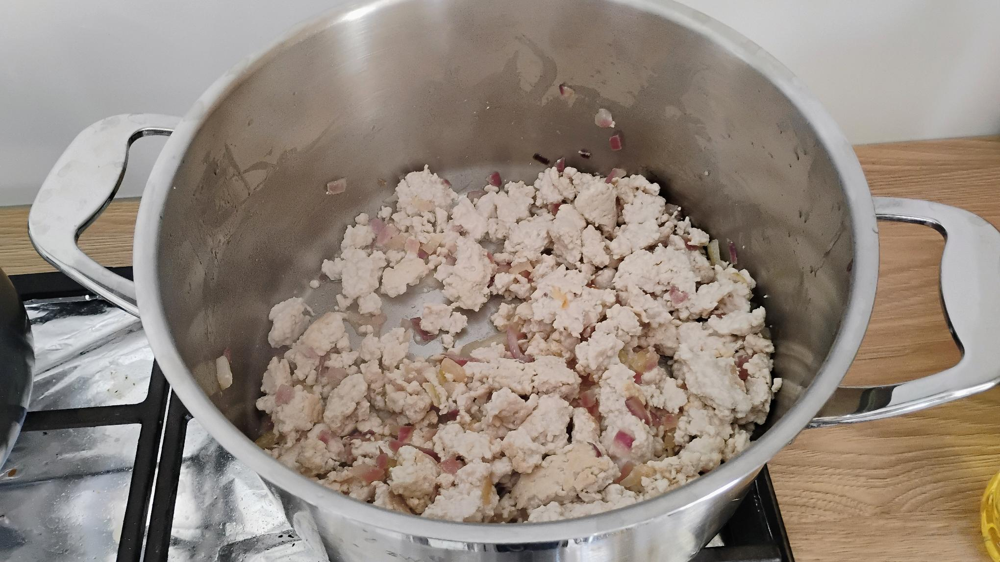
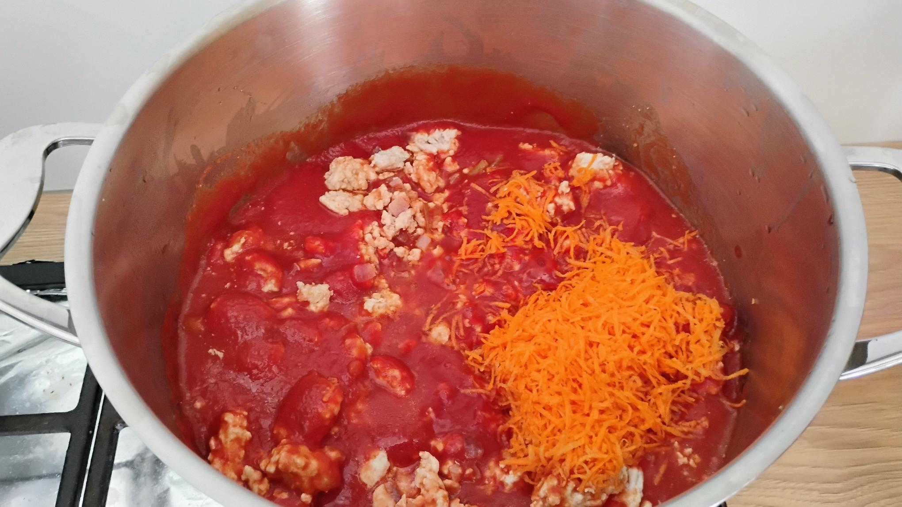
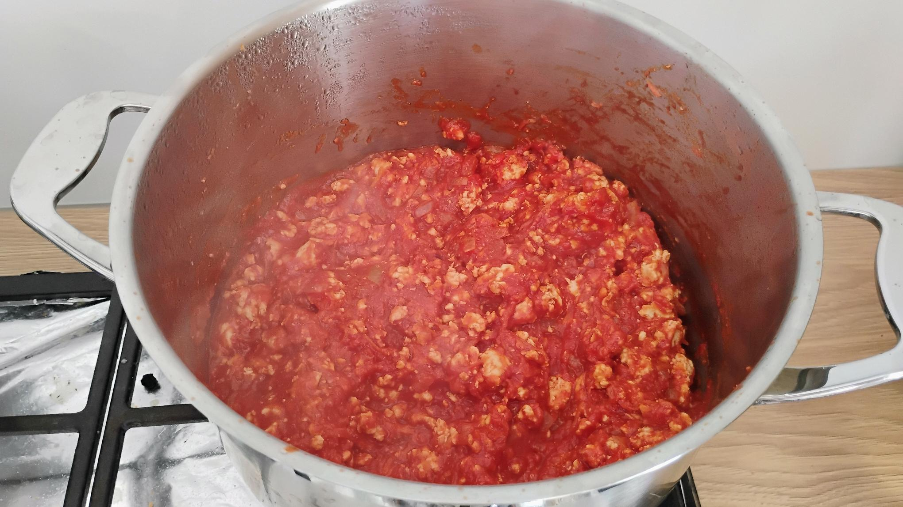

[Sekcja na min. 2000 znaków o historii dania].

Od najmłodszych lat przepadam z spaghetti bolognese. Najczęściej serwowano mi je z gotowego sosu instant, ale gdy dorosłem do gotowania to udało mi się dopracować przepis do odpowiedniego poziomu.

## Składniki

cebula, czosnek, mięso mielone, passata pomidorowa, marchew
i przyprawy: sól, pieprz, oregano, bazylia.

Proporcji umyślnie nie podaję. Wszystkiego na oko.

## Przepis

1. Drobno posiekaną cebulę podsmażam, potem dodaję zmielone mięso: drobiowe, wieprzowe, wołowe. To ostatnie daje fajny, ciemny kolor. Zapomniałem dodać, że na chwilę przed dodaniem mięsa wrzucam na patelnię drobno posiekany czosnek i chwilę podsmażam. Czasami zamiast siekać, kroję możliwie najcieńsze plastry czosnku, tak jak to zostało pokazane w filmie "Chłopaki z ferajny".

   [Scena z „Chłopaków z ferajny"](https://www.youtube.com/watch?v=rQV6CijIzrc)

2. Zalewam passatą pomidorową, dorzucam drobno starkowaną marchewkę, która robi robotę. Sos pomidorowy w wielu przepisach zaleca się, żeby słodzić. Marchewka zastępuje mi cukier w tym przypadku.

3. Doprawiam: najczęściej sól, pieprz, bazylia, oregano. Gotuję na małym ogniu, redukując sos pomidorowy. Cały proces może trwać ok. godziny, zależnie od ilości wlanej passaty.

