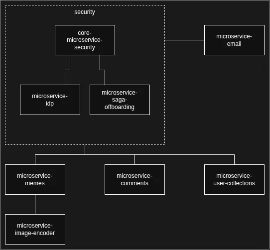

Most of the microservices in the [meme portal](/wpisy/en/meme-sandbox/) were written in Java, only the stubs and the image encoder went to Python. Why Java? A mature ecosystem, plenty of tooling and a focus on tests, which will later generate the documentation. Where there is Java, I use DDD and hexagonal architecture, and BCE (Boundary-Control-Entity) in the simpler cases. I set myself a rule: stubs and microservices with no domain logic and no documentation to generate are written in Python, image conversion for instance.

## Why microservices

This is a testing ground. I want to see:

* how the system behaves when selected services are switched off
* synchronous and asynchronous communication
* testing a distributed system

Once I release version 1.0, I plan two moves:

* forwards - add scaling
* backwards - go to a monolithic architecture. I know many people advise starting from a monolith, but that would take away the fun of building versions 0.1, 0.2 and 1.0. What I am after is a situation where the frontend application barely notices whether it talks to a monolith or to microservices.

## Architecture

This is a bird's eye view: the microservices and their dependencies, with no communication, no databases and no deployment.

Inside the "security" box there are three microservices:

* **core-microservice-security**: a generic security microservice. A container for use cases such as authentication or registration. The two microservices below work with it.
* **microservice-idp**: in the development environment it acts as a stub for identity providers such as Google or GitHub.
* **microservice-saga-offboarding**: the orchestrator of the account deletion saga. The functionality was deliberately pulled out into a separate microservice because of its domain knowledge about the meme portal.

To the right of the "security" section sits **microservice-email**, whose job is to send the mails confirming account registration. That is its only reason to exist. I could pull it into the security section, but sending mail has nothing to do with security. My plans for the future include ***microservice-notifications***, which will certainly make use of **microservice-email**, but will also use ***microservice-sms*** and ***microservice-push***. That would be version 1.0.

The microservices at the bottom, described from left to right:

* **microservice-memes**: uploading and storing images. Conversion is delegated to the microservice described below.
  * **microservice-image-encoder**: the image conversion microservice, written in Python.
* **microservice-comments**: comments. No comment required.
* **microservice-user-collections**: memes and comments can be saved to favourites.

Somewhere along the way I considered pulling votes out into a dedicated ***microservice-votes***, but for simplicity votes are stored in **microservice-memes** and **microservice-comments**. I might split it out in version 0.2, though not for the sake of splitting. I want the UI to show "n/a" in the vote count field when I kill that microservice. Version 0.1 will not put that to the test.
