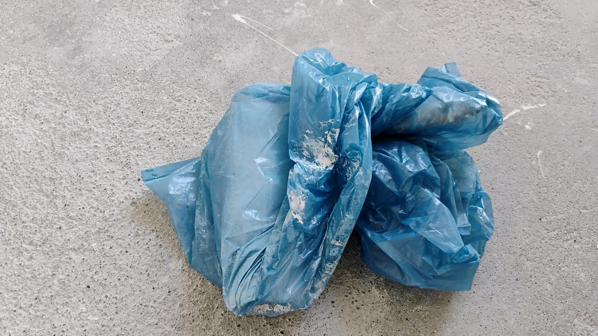
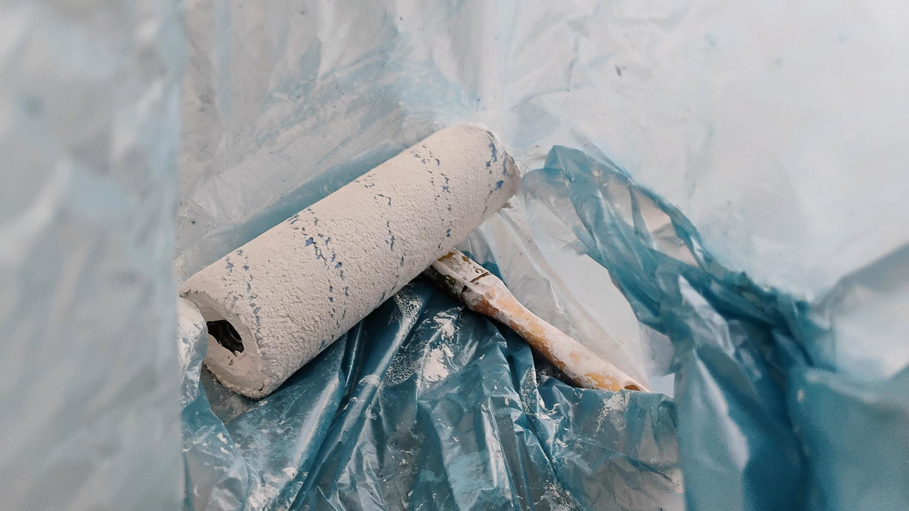
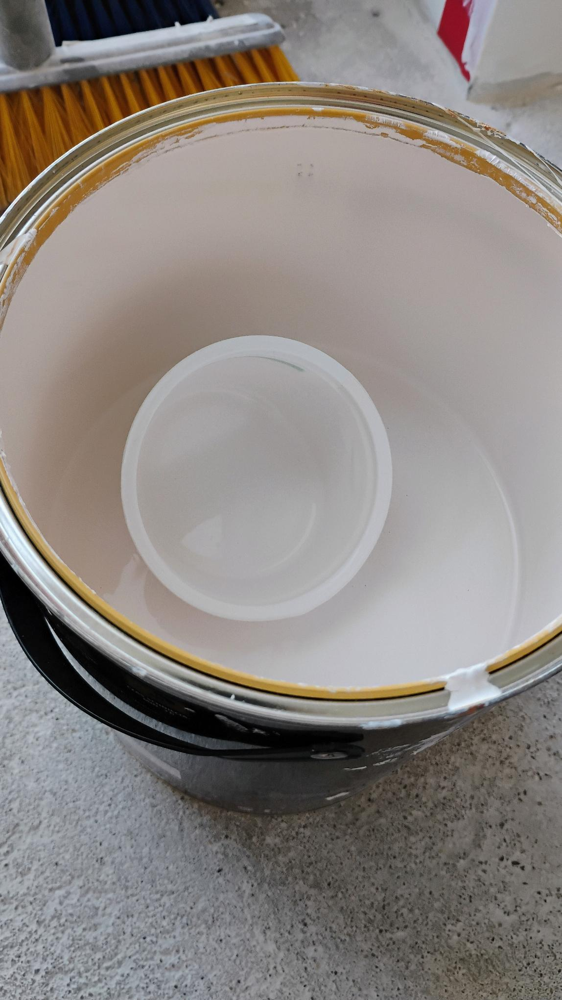
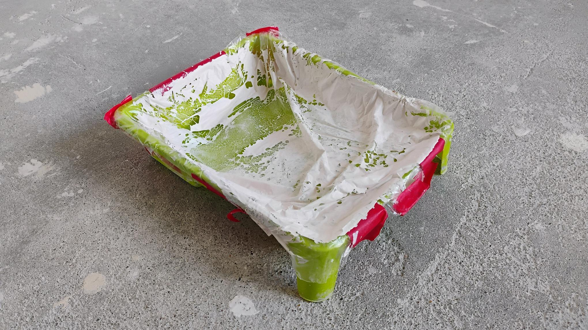
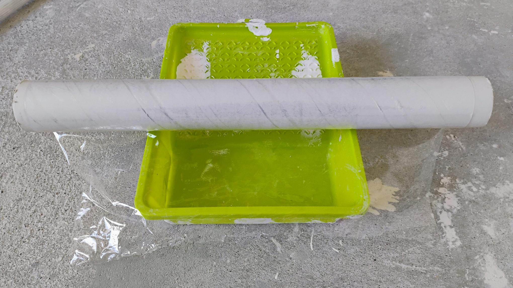
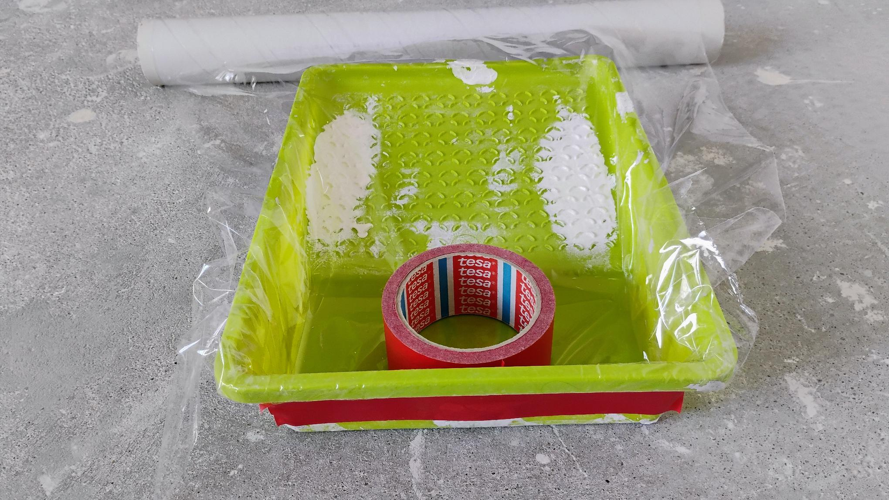
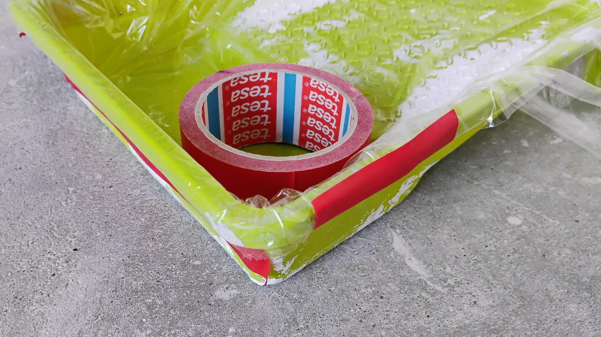
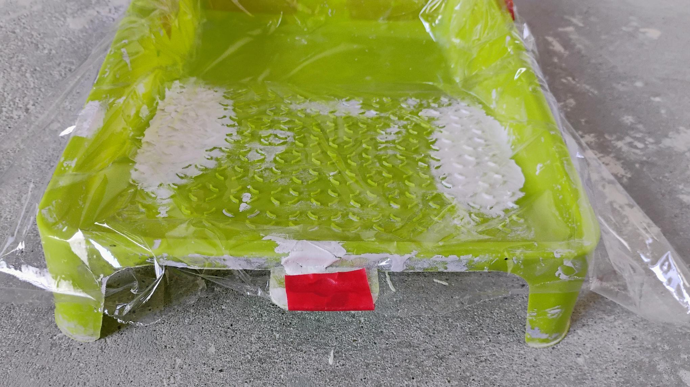
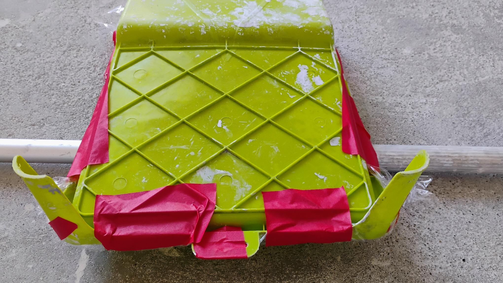

I've been renovating a second-hand flat on my own. I've picked up a lot of skills along the way.

## The classic: storing the roller and brush in a bin bag

This keeps them from drying out. They'll survive several days like this.

## Washing the roller

https://www.youtube.com/watch?v=amvry4CXXr8

The trick demonstrated by Chris from remont4you should be familiar to many. Instead of juggling buckets, filling them with water and screwing the roller onto a long threaded rod, I prefer to pour water into the tray and roll along it, top to bottom, a few times over. The water sweeps the roller nicely - you can see how fast it gets dirty during the first passes, and how much less willing the water is to take on colour later on. I pour out the dirty water, add fresh, and squeeze the roller by hand wearing a rubber glove. I keep going until there's a visible band on the roller and the water is harder to colour. I really should record a video of this procedure one day.

## Scooping paint from the tin into the tray

A cottage cheese tub is the best tool for the job. It works as a ladle for scooping the paint.

## Wrapping the tray in foil

How often?

Before every painting session. How long is a session? Let's say one room, 2-3 litres of paint, or a few hours of painting. You have to take a break at some point before laying down the next coat anyway.

I've noticed that even when I stash the tray in a bin bag, the thin layer of paint on the foil dries out, and on the next use the flakes get carried from the foil onto the surface you're painting.

